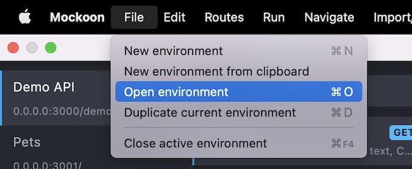

# Mockoon Serverless Project

A project to run multiple [Mockoon](https://mockoon.com/) environments in a Lambda function using the [Mockoon Serverless package](https://www.npmjs.com/package/@mockoon/serverless).

Currently deployed in our AWS Staging environment. You can try it using:

```bash
curl https://mockingbird.leanderpeter.de/example/hello
curl https://mockingbird.leanderpeter.de/example/get?query=one
```

## Local setup

Prerequisites:
1. Node v18.11.0+
2. [Serverless](https://www.serverless.com/framework/docs/getting-started): `npm install -g serverless`

## Adding Mockoon environments

The process to add a new Mockoon environment would be to:

1. Clone this repository.
2. Create a new branch.
3. Download [Mockoon](https://mockoon.com/download/). If you already have Mockoon installed, make sure to **update** it to the **latest version** (**version v1.22.0** or higher).
4. Create a new Mockoon environment using the Mockoon GUI and save it to the `environments` directory in this repository.
5. Configure and test your new environment using the Mockoon GUI.
6. Add the new environment to the `environments.json` file with the following fields:
   1. `path`: Path to the Mockoon environment file.
   2. `prefix`: The **unique** URL prefix for the environment. This prefix should match the prefix in the environment file in the `endpointPrefix` field.
   
      You can decide whether Mockoon should forward the prefix to your target URL or not by enabling or disabling the `proxyRemovePrefix` field in your environment file.
7. Run `npm run validate` to check all the preconditions are met.
8. Commit and push your changes to Gitlab.
9. Create a merge request to the `main` branch.
10. Your new environment will be deployed to the AWS Lambda function once your changes have been merged to the `main` branch. 🎉 

If you already have some Mockoon environments that you would like to move over to this repository, you should be able to find them at `/Users/<your username>/Library/Application Support/mockoon/storage`.

## Modifying Mockoon environments

You can open, edit and run Mockoon environments using the [Mockoon editor](https://mockoon.com/download/) (**version v1.22.0** or higher):



Follow the same process as above to push changes to Gitlab.

## Example Environment

You can view the example Mockoon environment at `environments/example.json`.

It has a mocked route at `<url>/example/hello`. It forwards all other API calls to [httpbin.org](https://httpbin.org/#/).

## Local development

You can start local emulation with:

```
serverless offline
```

Then you can call the API like this:

```bash
curl http://localhost:3000/example/hello
{"hello": true, "env": "example"}

curl http://localhost:3000/example/get\?search\=1234
{
  "args": {
    "search": "1234"
  },
  ...
}
```

## Linting

Run `npm run lint` to lint files using ESLint and Prettier.

## Deployment

Install dependencies with:

```bash
npm install
```

and then deploy with:

```bash
serverless deploy
```

After running deploy, you should see output similar to:

```bash
Deploying aws-node-express-api-project to stage dev (eu-central-1)

✔ Service deployed to stack mockoon-data-dev (51s)

endpoint: ANY - https://xxxxxxxxxx.execute-api.us-east-1.amazonaws.com/dev
functions:
  api: aws-node-express-api-project-dev-api (766 kB)
```

You should then be able to call the API like this:

```bash
curl https://xxxxxxxxxx.execute-api.us-east-1.amazonaws.com/example/hello
{
    "hello": true,
    "env": "example"
}

curl https://xxxxxxxxxx.execute-api.us-east-1.amazonaws.com/example/get\?search\=1234
{
  "args": {
    "search": "1234"
  },
	...
}
```
